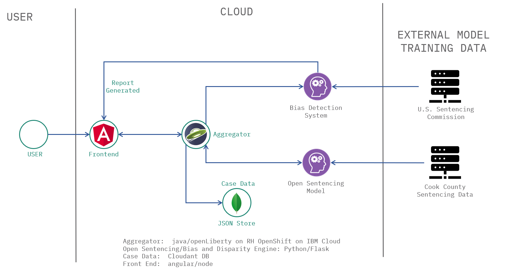

# Open Sentencing - Aggregator

Aggregator is the core module of Open Sentencing Model which exposes REST endpoints to manage and maintain inventory of public attorney, clients and case related information. Aggregator is the point of articulation between the UI component and Data Prediction/Analytics modules. This is build using the IBM starter kit comes pre-configured as a microservice with Liberty server and uses CloudAnt database for storage. This is integrated with OpenAPI specification to discover and understand the capabilities of the service without access to source code, documentation, or through network traffic inspection.

# Architecture
The architecture of the complete system is shown below.  



# Create and deploy Aggregator application

To build the application you can run
```bash
docker build . -t <your-tag>
```
For the application to run, a Cloudant database is required. You can provision a free version from IBM Cloud or provide your own one. The HELM charts expect an IAMKey and the DB URL as parameters.
If you want to deploy the application to an OpenShift Cluster (ROKS) on IBM Cloud, perform the following steps:
```bash
ibmcloud login
ibmcloud cr login # logs you in to the Docker registry with your local Docker CLI
docker push <your-tag>
# Make sure your Container Registry is accessible by the ServiceAccount you are using, the default namespace and default ServiceAccount in an ROKS cluster are already integrated by default with the IBM Container Registry in your cloud account
helm package chart/base/
helm install --set image.repository=us.icr.io/emb-race-team/os-aggregator --set image.tag=helm-01 --set db.iamkey=<your-iam-key> --set db.url=https://<your-db-instance> aggregator os-aggregator-1.1.4.tgz --namespace deploy-test
```

If you want to install to a different namespace than default, you have to copy the secret first as described here (or create a new one): https://cloud.ibm.com/docs/openshift?topic=openshift-registry#copy_imagePullSecret.

## How to access the application

Once can use the [openapi spec](src/main/resources/META-INF/openapi.yaml) or [openapi url](http://localhost:8090/openapi/ui/) to find the documentation of REST services exposed


### Building Locally

To get started building this application locally, you can either run the application natively or use the [IBM Cloud Developer Tools](https://cloud.ibm.com/docs/cli?topic=cloud-cli-getting-started) for containerization and easy deployment to IBM Cloud.

#### Native Application Development

* [Maven](https://maven.apache.org/install.html)
* Java 8: Any compliant JVM should work.
  * [Java 8 JDK from Oracle](http://www.oracle.com/technetwork/java/javase/downloads/index.html)
  * [Java 8 JDK from IBM (AIX, Linux, z/OS, IBM i)](http://www.ibm.com/developerworks/java/jdk/),
    or [Download a Liberty server package](https://developer.ibm.com/assets/wasdev/#filter/assetTypeFilters=PRODUCT)
    that contains the IBM JDK (Windows, Linux)

To build and run the application:
1. `mvn install`
1. `mvn liberty:run-server -DAGGREGATOR_DB_IAM_KEY=***db-secret*** -DAGGREGATOR_DB_URL=****DB-url***`

To run an application in Docker use the Docker file called `Dockerfile`. If you do not want to install Maven locally you can use `Dockerfile-tools` to build a container with Maven installed.

You can verify the state of your locally running application using the Selenium UI test script included in the `scripts` directory.

## License

This sample application is licensed under the Apache License, Version 2. Separate third-party code objects invoked within this code pattern are licensed by their respective providers pursuant to their own separate licenses. Contributions are subject to the [Developer Certificate of Origin, Version 1.1](https://developercertificate.org/) and the [Apache License, Version 2](https://www.apache.org/licenses/LICENSE-2.0.txt).

[Apache License FAQ](https://www.apache.org/foundation/license-faq.html#WhatDoesItMEAN)

## Sentencing Data

This site provides applications using data that has been modified for use from its original source, www.ida.ussc.gov, an official website of the U.S. Sentencing Commission. The U.S. Sentencing Commission makes no claims as to the content, accuracy, timeliness, or completeness of any of the data provided at this site. The data provided at this site is subject to change at any time. It is understood that the data provided at this site is being used at one’s own risk.
